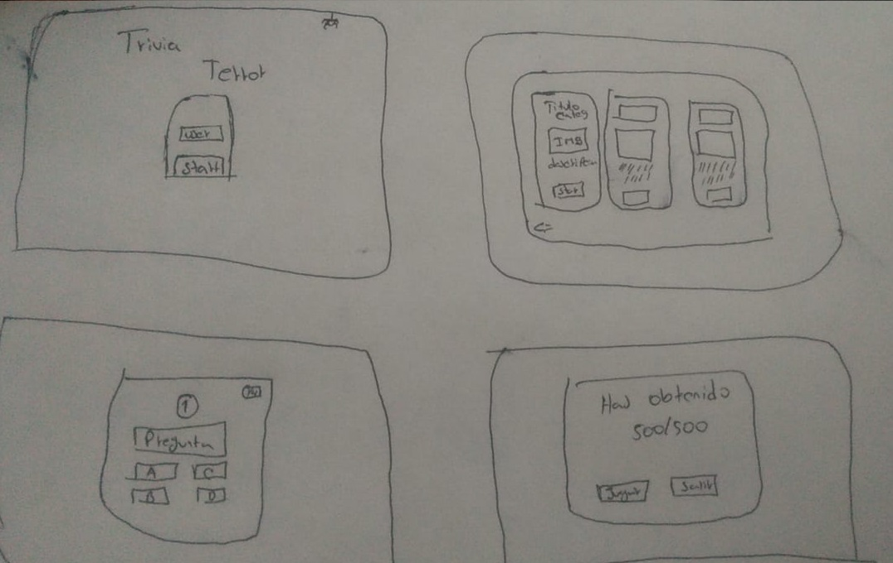
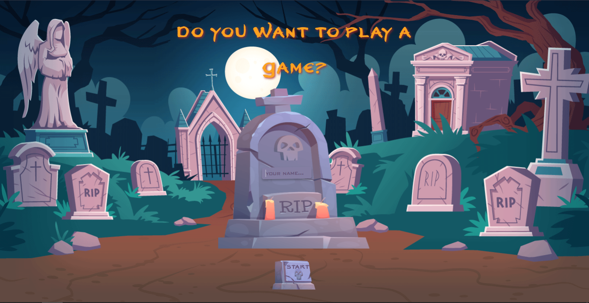
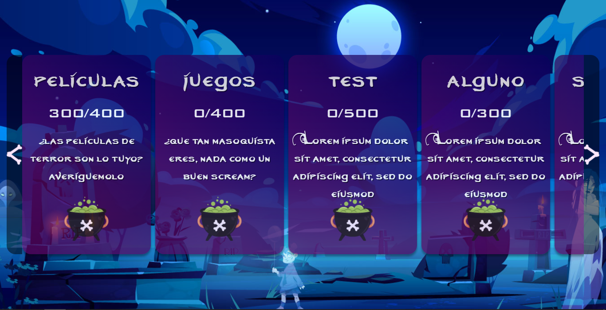
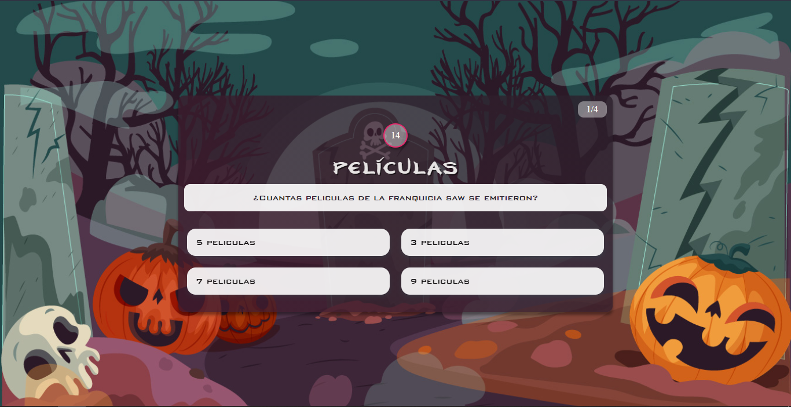
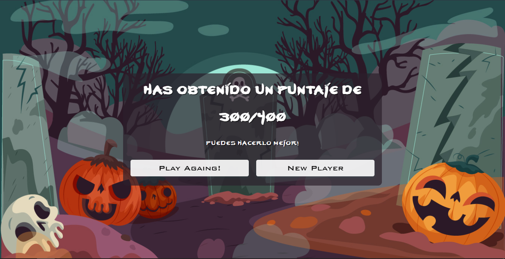

# app trivia
_proyecto desarrollado siguiendo como guia lineamientos presentados en el proyecto [trivia-laboratoria](https://github.com/Laboratoria/bootcamp/tree/main/projects/00-trivia)_ 


## índice
* [1. Resumen del proyecto](#1-resumen-del-proyecto)
* [2. Objetivos de aprendizaje](#2-objetivos-de-aprendizaje)
* [3. Proceso creativo 🔧](#3-proceso-creativo)
* [4. Pre-requsitos 📋](#4-pre-requisitos)
* [5. Demo](#5-demo)
* [6. autores ✒️](#5-autores)


## 1. Resumen del proyecto
Laboratoria propone la siguiente descripcion de proyecto:

> ¿Qué tengo que hacer exactamente? En este proyecto tendrás que construir una aplicación web que le permita a un usuario responder distintas preguntas escogiendo sus respuestas de una lista de alternativas. 
> La temática es libre. Tú debes crear la mejor trivia que puedas y luego pensar en cómo debe ser esa experiencia de uso (qué pantallas, explicaciones, mensajes, colores, ¿marca?) etc.


la tematica abordada fue el terror:

>> Historia - peliculas - videojuegos-etc..

## 2. Objetivos de aprendizaje

### UX

- [x] Diseñar la aplicación pensando y entendiendo al usuario.
- [x] Crear prototipos para obtener feedback e iterar.


### DOM

- [x] Entender y reconocer los selectores del DOM.
- [x] Manejar eventos del DOM.
- [x] Manipular dinámicamente el DOM.

### JavaScript

- [x] Utilizar funciones como mecanismo de control de flujo y reuso de código.
- [x] Conocer la diferencia entre los distintos tipos de datos.
- [x] Buenas prácticas de desarrollo
- [x] Utilizar identificadores descriptivos (Nomenclatura | Semántica).


## 3. Proceso creativo 🔧


### Prototipo baja fidelidad 📋

<table>
    <tr>
        <td></td>
    </tr>

</table>

### Prototipo final

<table>
    <tr>
        <td>Inicio</td>
        <td>Menu categorias</td>
    </tr>
    <tr>
        <td></td>
        <td></td>
    </tr>
    <tr>
        <td>preguntas</td>
        <td>resultados</td>
    </tr>
    <tr>
        <td></td>
        <td></td>
    </tr>
 </table>


## 4. Pre-requisitos
_Necesario `npm`_

```
npm install -g sass
```


# 5. Demo 

* deploy del proyecto [DEPLOY](https://juanc-jc.github.io/app-trivia-terror/.)


* repositorio del proyecto [REPO](https://github.com/JuanC-JC/app-trivia-terror)


# 6. Autores ✒️

_Proyecto desarrollado por:_

* **Juan Camilo ibañez** - *ingeniero industrial* - [proyectos](https://github.com/JuanC-JC)
